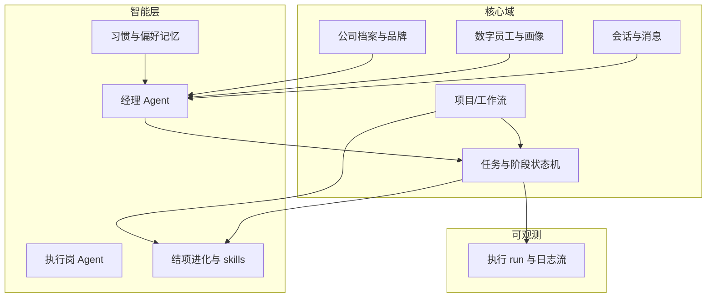

# 一人公司 · 项目协作产品方案

## 一、产品定位

面向 **独立接案者 / 一人公司老板**：把「接到的项目」当成一条可管理的流水线，用 **群聊式协作界面** 组织经理、前后端、运维等角色；角色既可由老板 **手动创建**，也可由 **AI 生成数字人 Agent** 承担部分沟通、拆解与备忘，降低独自扛全流程的认知负担。

---

## 二、当前已实现功能（以本仓库为准）

以下为 **现已具备或可演示** 的能力，便于与「计划功能」对照。

### 1. 账号与基础能力

- 手机号注册 / 登录、修改密码；本地会话（Token）与「我的」资料展示。
- 统一 HTTP 请求层：Bearer 鉴权、超时与错误提示；**401** 时清理会话并回登录页。

### 2. 工作流（项目级协作容器）

- **项目 Tab**：创建工作流（名称、描述）、列表、下拉刷新；进入 **工作台**。
- **布置任务**：选择工作流、填写目标与优先级，通过后端 **指令下发** 生成任务。
- **工作台**：  
  - **任务**：按部门 / 看板 / 列表查看，更新进度（滑块 + 备注）。  
  - **沟通**：线程（内部 / 客户）、发消息、播报、消息关联任务；可选 WebSocket 推送刷新。  
  - **图谱**：协作关系图（依赖后端数据结构）。  
  - **动态**：事件时间线（依赖后端接口）。

### 3. 消息与聊天

- 登录后，**消息 Tab** 聚合各工作流下的沟通线程，进入 **聊天页** 与后端消息接口一致收发。  
- 未登录时仍保留本地演示会话（如「老板」对话），用于体验空态与导航。

### 4. 组织与展示

- **首页**：按「高管直连 / 组织条线」展示部门与角色（**本地静态数据**，用于展示与跳转部门页）。  
- **部门详情**：多部门定制组件，偏内容与导航，**不依赖**工作流 API。

### 5. 工程与运维向能力

- 环境变量配置 API 基址、代理、可选 **WebSocket** 地址；比赛用 **演示脚本与接口说明** 见 `docs/DEMO_AND_API.md`。

---

## 三、计划功能（目标形态：一人公司 + 项目群 + 真人 / AI 角色）

以下在「当前工作流 + 沟通」之上延伸，形成你描述的产品故事；实现可分阶段。

### 1. 接项目 → 建「项目群」

- 每接一个外部项目，老板 **一键创建项目空间**（可对应现有「工作流」升级命名与心智）。  
- 项目内默认生成 **主群聊**（对内协作），可选 **客户可见子频道**（对标现有内部 / 客户线程），避免私聊与项目信息散落。

### 2. 角色与编制：自己造团队

- 老板在项目中 **添加成员槽位**：经理、前端、后端、运维、测试、设计等（模板可预设，名称与职责可改）。  
- 每个槽位绑定：**显示名、职责说明、提醒偏好**（如仅 @ 时推送）。  
- 未邀请真人前，槽位可处于 **空置 / 由 Agent 代理** 两种状态，避免「一个人演全场」时界面空洞。

### 3. AI 数字人 Agent（创新核心之一）

- **创建方式**：一句话描述「我需要怎样性格的交付经理」或选模板，由大模型生成 **角色卡**（人设、口吻、负责范围）。  
- **能做什么（建议优先级）**：  
  - **对话侧**：在群内代老板做纪要、待办拆分、风险提示（不直接改生产，只出建议）。  
  - **任务侧**：把自然语言需求草稿成 **可下发的指令结构**（对标现有 `postCommand` 载荷），老板确认后执行。  
  - **知识侧**：项目私有知识库（报价单模板、技术栈约束）RAG 检索，回答「这个客户之前约定过什么」。  
- **边界**：敏感操作（对外报价、删数据）需 **人工确认** 或 **二次密码**，符合竞赛与合规叙事。

### 4. 建议你一并考虑的产品功能（增强故事完整度）

| 方向 | 说明 |
|------|------|
| **项目生命周期** | 立项 → 交付 → 维保，状态驱动群聊置顶与待办模板。 |
| **对外边界** | 客户只进「客户频道」；内部群默认对客户不可见。 |
| **人机协作流** | @Agent 与 @真人 分流；Agent 回复带「建议 / 已采纳」标记，便于答辩展示决策链。 |
| **轻量 SLA** | 截止日、里程碑与看板联动，首页或项目卡展示「今日风险」而非仅任务列表。 |
| **留痕与复盘** | 关键指令、变更、客户承诺写入只追加时间线（可与现有 events 概念合并），强调「一人公司也要专业可追溯」。 |

---

## 四、创新点归纳（申报书可用）

1. **「一人公司」心智下的最小协作闭环**：单人账号 + 多角色槽位 + 群聊式项目空间，用 **组织方法** 解决独立开发者的 **并行项目与上下文切换** 问题。  
2. **真人角色与 AI Agent 同槽位可切换**：同一「后端」槽先由 Agent 占位答疑，真人入驻后继承上下文，避免冷启动与交接断层。  
3. **自然语言 → 结构化指挥链**：需求口述经 LLM 解析为可执行指令（对齐现有下发能力），强调 **人机共审** 而非全自动。  
4. **项目级沟通与任务同源**：群聊、线程、任务、动态同一套项目 ID，避免 IM 与工单两套真相（与当前「工作流 + comms」方向一致，可写为演进目标）。  
5. **轻合规叙事**：客户承诺与变更留痕、对外回复可审计，适合比赛中的「可信协作 / 小团队数字化」选题。

---

## 五、与现有代码的关系（给开发自勉）

- **可复用**：工作流、任务、沟通线程、指令下发、消息列表与聊天、401 与会话。  
- **需扩展**：成员 / 角色实体、项目群与槽位模型、Agent 服务与角色卡存储、权限（客户频道）。  
- **文档**：演示与接口仍以 `docs/DEMO_AND_API.md` 为准；本产品叙事以本文档为准迭代。

如需把某一节改成「评委一分钟版」或 PPT 大纲，可以说明页数与时长，再单独压缩一版。

---

## 六、愿景需求纲要（对应要点 1～8）

| 编号 | 需求摘要 |
|------|----------|
| 1 | **多 Agent 协作**：用户向「经理」下达意图，由经理分析并分发给执行岗（前端、后端等）。 |
| 2 | **公司品牌统一**：向全员注入品牌与理念；AI 生成标语并在 **首页** 展示。 |
| 3 | **聊天呈现**：各角色在统一聊天界面中协作与留痕（与现有消息/会话能力衔接）。 |
| 4 | **员工进化与记忆**：每项目若干次「进化」，沉淀为可执行工作流与 skills；员工档案含性格、爱好、性别、项目经历；支持一键「裁员」；长期记忆用户作息、用语与表达习惯（含指令释义规则）。 |
| 5 | **执行过程可视化**：任务/编码/命令执行过程可观测，体验接近 Claude Code 等「可见执行」形态。 |
| 6 | **交付流程升级**：从「写代码→部署=完成」扩展为 **计划→方案→执行→多轮测试/修改（循环）→上线→总结进化** 的闭环。 |
| 7 | **工商与合规入口**：公司注册、报税、资质申请等 **信息聚合与办事指引**（不替代法定流程与专业机构）。 |
| 8 | **价值主张**：从「一人牛马」到「一人真老板、省心决策」。 |

---

## 七、分阶段实施计划与方案框架

### 7.1 总体原则

- **先跑通数据与角色模型，再接大模型**：没有稳定的「项目 / 员工 / 任务 / 会话」实体，Agent 与可视化会反复返工。  
- **人机共审**：经理拆解、分发、对外承诺均需 **可编辑确认** 与 **操作留痕**。  
- **合规边界**：第 7 点只做 **官方渠道链接、清单模板、进度提醒**；不接「代跑灰色流程」类能力，避免法律与比赛风险。

### 7.2 阶段划分（建议）

| 阶段 | 目标 | 交付物（可演示） |
|------|------|------------------|
| **P0 基础** | 经理分发 + 品牌首页 + 聊天闭环 | 指令→经理 Agent（规则/LLM）→子任务到前端/后端槽位；首页展示公司标语与品牌配置；会话列表与聊天页统一。 |
| **P1 记忆与员工档案** | 员工画像 + 习惯记忆 + 裁员 | 员工表扩展字段；本地/服务端偏好存储；「终结者式」一键停用 Agent 并归档上下文。 |
| **P2 进化与工作流** | 项目结束触发进化、skills 更新 | 项目状态机「已结项」→ 触发总结 → 生成/更新 skills 与可复用工作流片段；限制每项目进化次数可配置。 |
| **P3 执行可视化 + 阶段流程** | 类 Claude Code 观感 + 六阶段闭环 | 执行日志流式展示、步骤树/时间线；工作流模板与看板阶段对齐「计划→方案→执行→测试循环→部署→总结」。 |
| **P4 政务聚合** | 办事入口与提醒 | 地区可选；链接至国家/地方政务平台；材料清单与日历提醒；**明确免责声明**。 |

### 7.3 按需求拆解的实现步骤

**要点 1：多 Agent 协作（经理分发）**

1. 定义 **角色类型枚举**：经理、前端、后端、运维等，与现有「工作流任务 / 部门」映射。  
2. 实现 **经理服务**（可先规则引擎 + 可选 LLM）：输入用户自然语言 → 输出结构化子任务列表（负责人、优先级、依赖）。  
3. 子任务写入现有 **指令 / 任务 API** 或扩展表；前端在 **消息或工作台** 展示「待确认」再下发。  
4. 验收：一条用户指令 → 经理生成 ≥2 条子任务 → 执行岗会话或任务列表可见。

**要点 2：品牌与标语上首页**

1. 增加 **公司档案** 实体：品牌名、理念关键词、禁忌词、行业。  
2. **标语生成**：调用 LLM 生成 3～5 条候选，用户选定一条「上屏」；写入配置表。  
3. 首页 **首屏 Banner/卡片** 读取配置；支持手动改字覆盖 AI。  
4. 「灌输员工」：将同一份 `companyProfileId` 注入各 Agent 的 system prompt 或 RAG 片段。

**要点 3：聊天页面展示**

1. 统一 **会话维度**：项目群、1 对 1 员工、工作流线程共用「会话 ID」规范。  
2. 消息体扩展：`senderType`（人 / Agent / 系统）、`taskRef`（关联任务）。  
3. UI：按现有微信式列表 + 气泡页迭代即可；重点在 **数据模型一致**，避免多套会话源。

**要点 4：进化、画像、裁员、习惯记忆**

1. **画像字段**：姓名、性别、性格标签、爱好、项目经历（列表），与 `virtualTeamStore` / 后端员工表对齐。  
2. **进化**：项目 `closed` 事件 → 异步任务：拉取该项目全部消息与任务 → LLM 总结 → 写入 `skills` 与 `playbook` 片段；每项目进化次数上限配置。  
3. **裁员**：软删除员工 + 解除会话写权限 + 保留审计日志（终结者式文案仅作产品趣味，实现上是合规停用）。  
4. **习惯记忆**：`userPreferences` 表存作息窗口、常用句式映射（如「帮我解决」→ 标准操作步骤）；每次请求经理 Agent 前注入；注意 **隐私与可清除**（用户一键清空记忆）。

**要点 5：执行过程可视化（类 Claude Code）**

1. **技术路径（择一或组合）**：  
   - **SSE / WebSocket** 推送执行器日志行（脚本、构建、测试命令 stdout/stderr）。  
   - 前端 **步骤树 + 折叠日志**（无需完整终端仿真也可答辩）。  
   - 若需终端感：Web 端 **xterm.js + 后端 PTY**（成本高，放 P3）。  
2. 与 **任务 ID** 绑定：每个执行实例 `runId`，消息中可插入「查看执行」入口。

**要点 6：六阶段交付流程**

1. 在工作流或项目上增加 **阶段状态机**：`planning` → `design` → `executing` → `testing` → `deploying` → `retrospective`（测试阶段可循环回 executing）。  
2. 看板列与阶段对齐；**完成标准**每阶段可配置检查项。  
3. 结项时自动生成 **复盘文档** 并触发要点 4 的进化。

**要点 7：注册 / 报税 / 资质**

1. 产品形态：**办事中心** 页：分类卡片 + 官方链接 + 材料 PDF 模板下载 + **截止日提醒**（本地日历可选）。  
2. 文案：**本功能不提供代办与法律意见，请以主管部门与专业机构为准。**  
3. 后续可接 **政府开放平台 API**（若赛题允许且地区开放）。

**要点 8：价值传播**

1. 首页与申报书用 **对比叙事**：「任务/日报/经理总览」减轻认知负荷；用数据埋点（可选）展示「节省的重复沟通时间」。  
2. 与 P0～P2 能力绑定宣传，避免空泛 slogan。

### 7.4 数据与模块依赖简图（实现时对照）

### 7.5 风险与排期建议

- **模型成本**：经理与进化总结调用频繁，需 **缓存、批量、小模型兜底**。  
- **一致性**：多端会话与任务状态需 **单真相源**，优先服务端状态机。  
- **比赛演示**：优先打通 **P0 + 要点 1/2/3** 的可录屏闭环，再叠可视化与进化叙事。

---

*文档版本：在第五节之后追加「愿景纲要 + 实施框架」；与代码迭代同步更新 `docs/DEMO_AND_API.md` 中的接口说明。*
